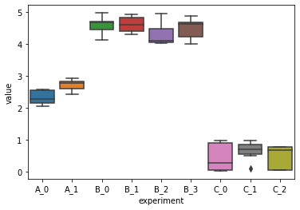
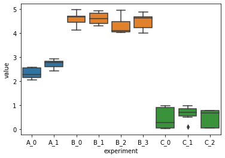

Scenario: we have data from multiple experiments. The experiment names are joint by project name and auto-incremented task id. The number of records in each task varies, and the number of tasks in each project also varis. We want to plot a boxplot to examine the distribution but would like to color boxes from same project as the same. To do so we need to set the *palette* argument.


```python
import pandas as pd
import numpy as np
import seaborn as sns
import matplotlib
import itertools
%matplotlib inline
```


```python
vals = []
for proj in list("ABC"):
    offset = np.random.randint(0, 5)
    for task_id in range(np.random.randint(2, 5)):
        vals.extend([
            (f"{proj}_{task_id}", v) for v in np.random.random(np.random.randint(5, 10)) + offset
        ])
df = pd.DataFrame(vals, columns=["experiment", "value"])
```


```python
df.sample(5)
```


<div>
<style scoped>
    .dataframe tbody tr th:only-of-type {
        vertical-align: middle;
    }

    .dataframe tbody tr th {
        vertical-align: top;
    }

    .dataframe thead th {
        text-align: right;
    }
</style>
<table border="1" class="dataframe">
  <thead>
    <tr style="text-align: right;">
      <th></th>
      <th>experiment</th>
      <th>value</th>
    </tr>
  </thead>
  <tbody>
    <tr>
      <th>12</th>
      <td>B_0</td>
      <td>4.565408</td>
    </tr>
    <tr>
      <th>30</th>
      <td>B_2</td>
      <td>4.971167</td>
    </tr>
    <tr>
      <th>1</th>
      <td>A_0</td>
      <td>2.569001</td>
    </tr>
    <tr>
      <th>25</th>
      <td>B_1</td>
      <td>4.304160</td>
    </tr>
    <tr>
      <th>35</th>
      <td>B_3</td>
      <td>4.443520</td>
    </tr>
  </tbody>
</table>
</div>


```python
df.experiment.value_counts()
```


    B_0    9
    C_0    9
    B_1    8
    A_1    7
    B_3    7
    C_1    7
    B_2    6
    A_0    5
    C_2    5
    Name: experiment, dtype: int64


A straight forward `seaborn` boxplot without `palette`:


```python
sns.boxplot(data=df, x="experiment", y="value")
```


    <AxesSubplot:xlabel='experiment', ylabel='value'>


    

    


Now set the palette. When passing a list type `palette` argument for `seaborn.boxplot`, the length should be same as the plot's x-ticks, which is the size of unique values for the x. 
1. Sort the DataFrame to make sure records are properly ordered by experiment names. You can never be too cautious when dealing with manually assembled data.
1. Select a palette using `color_palette`.
1. Assign `palette` argument using `np.searchsorted()` to locate proper index in the palette.


```python
df = df.sort_values(by="experiment")
proj = df["experiment"].str.slice(0, 1)
```


```python
col_pal = sns.color_palette(n_colors=len(proj.unique()))
pal_ind = np.searchsorted(proj.unique(), df.experiment.unique()) - 1
pal = [col_pal[i] for i in pal_ind]
```


```python
sns.boxplot(data=df, x="experiment", y="value", palette=pal)
```


    <AxesSubplot:xlabel='experiment', ylabel='value'>


    

    


Here the trick is `np.searchsorted(a, v, side='left', sorter=None)`. Its docstring: "Find indices where elements should be inserted to maintain order." We use this method to place the unique experiment names in the project name list.
