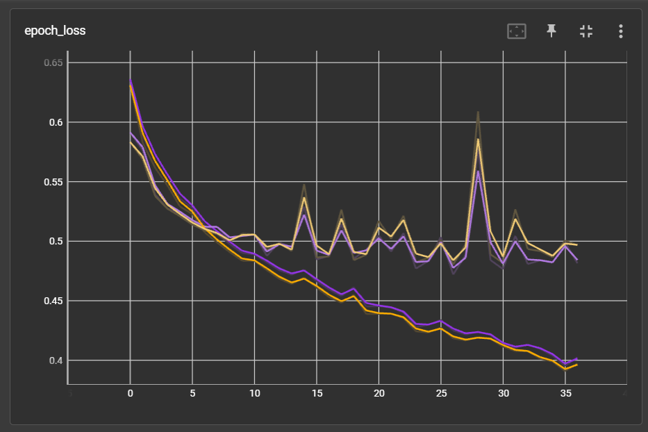
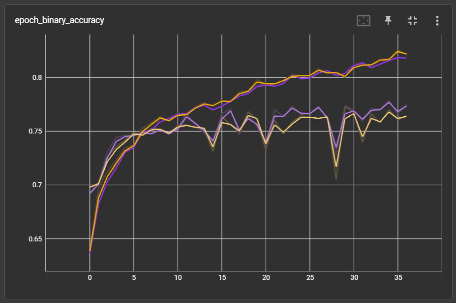

The pre-trained attention-based language models have proved themselves super powerful. In life science field, models pre-trained on protein sequences can also extract a considerable amount of hidden information. [A short note on BERTology in this blog](https://yanshouyu.github.io/BERTology-meets-biology/).

Sometimes, just laying a very simple MLP on top of bert's embedding can give us quite satisfactory results. Below are my notes on using [prot_bert](https://huggingface.co/Rostlab/prot_bert) on a binary classification task.

Pre-trained models can be found from [Huggingface](https://huggingface.co/). Since I use TensorFlow I need to load the weights from Rostlab/prot_bert into a keras model. In the `transformers` package it only takes one extra argument.

## Model Implementation

First create the base model class.

```python
class ProtBertBase(keras.models.Model):
    def __init__(self, finetune: bool = False, *args, **kwargs):
        super(ProtBertBase, self).__init__(*args, **kwargs)
        self.tokenizer = TFBertTokenizer.from_pretrained("Rostlab/prot_bert")    # 1
        self.base_model = TFBertModel.from_pretrained("Rostlab/prot_bert", from_pt=True)    # 2
        self.base_model.trainable = finetune    # 3
    
    def call(self, inputs):
        encoded = self.tokenizer(inputs)
        embedding = self.base_model(**encoded)
        # 4
        pool_emb = tf.reduce_mean(
            tf.ragged.boolean_mask(
                embedding.last_hidden_state,
                mask=tf.cast(
                    encoded['attention_mask'], 
                    dtype=bool,
                )
            ),
            axis=1
        )
        outputs = self.top_model(pool_emb)
        return outputs
    
    # 5
    @classmethod
    def from_top_model_weights(cls, path, *args, **kwargs):
        model = cls(*args, **kwargs)
        model.top_model.load_weights(path)
        return model
```

Subclass the base model class to add the `top_model`:

```python
class MlpOnProtBertBase(ProtBertBase):    # 6
    "prot_bert embedding + simple MLP"
    def __init__(self, units, *args, **kwargs):
        super(MlpOnProtBertBase, self).__init__(*args, **kwargs)
        self.top_model = keras.models.Sequential([
            keras.layers.Dense(units, activation='relu'),
            keras.layers.Dense(1, activation='sigmoid')
        ])
```

Let's break down the codes by each comment item.

1. `TFBertTokenizer`
Instead of preprocessing the sequences and save the embedding for modelling, we can use the `TFTokenizer` as a keras layer and process the embedding on the fly as its docstring says:
    > In-graph tokenizers, unlike other Hugging Face tokenizers, are actually Keras layers and are designed to be run when the model is called, rather than during preprocessing.
1. Load weights from PyTorch. Since *rostlab/prot_bert* only has the PyTorch weights we need to specify `from_pt=True`.
1. The model is trainable by default. If we just need the embedding, we don't need to pass gradients to base model. Only when we want to fine tune the base model we need to make the base model trainable.
1. The tokenizer outputs a dict with 3 keys: *'input_ids', 'attention_mask', 'token_type_ids'*. By my experiments, masked embedding performs better (also will be discussed below).
1. If the base model is not changed we don't have to save the full model. This classmethod is used to retrieve weigths from the saved top model.
1. By subclassing the `ProtBertBase`, we only need to define the `top_model`.


## `pooler_output` vs. `last_hidden_state`

The embedding has 2 attributes, `pooler_output` with shape *(batch, embedding_dim)* and `last_hidden_state` with shape *(batch, seq_max_len, embedding_dim)*. Here the *embedding_dim* is 1024.

Initially I used the `pooler_output` but the result was terrible. The model could not learn anything. Each batch was either all True or all False. After several trials I changed to pool the `last_hidden_state` by the *seq_max_len* dimension and it turned out to have quite good results.

[A similar discussion](https://github.com/huggingface/transformers/issues/1328) mentioned that there is no universal standard. Better experiment on both.

## Mask on pooled embedding

After I switched to pool the `last_hidden_state` for embedding, I just pooled it along the 2nd dimension (*seq_max_len*):
```python
pool_emb = tf.math.reduce_mean(embedding.last_hidden_state, axis=1)
```

Since the sequence lengths are different, it is natural to think about applying the mask:

```python
pool_emb = tf.reduce_mean(
    tf.ragged.boolean_mask(
        embedding.last_hidden_state,
        mask=tf.cast(
            encoded['attention_mask'], 
            dtype=bool,
        )
    ),
    axis=1
)
```

The trick here is the `tf.ragged.boolean_mask` which will return a ragged tensor by removing elements masked. Here's a simple example:

```python
var = tf.Variable([
    [[0.5, 0.5], [0.8, 0.8], [1.0, 1.0]], 
    [[0.2, 0.2], [0.4, 0.4], [1.0, 1.0]],
])
# Shape: (batch, seq_len, emb_dim)
var.shape
"""
TensorShape([2, 3, 2])
"""

mask = tf.Variable([
    [1, 1, 0],
    [1, 0, 0]
])
# mask dtype must be boolean
mask = tf.cast(mask, dtype=bool)
# `mask`'s shape must be a prefix of `data`'s shape
mask.shape
"""
TensorShape([2, 3])
"""

# if we don't mask
tf.reduce_mean(var, axis=1)
"""
<tf.Tensor: shape=(2, 2), dtype=float32, numpy=
array([[0.76666665, 0.76666665],
       [0.53333336, 0.53333336]], dtype=float32)>
"""

# what the ragged tensor looks like:
tf.ragged.boolean_mask(var, mask=mask)
"""
<tf.RaggedTensor 
[
    [[0.5, 0.5], [0.8, 0.8]], 
    [[0.2, 0.2]]
]>
"""

# result after mask:
tf.reduce_mean(tf.ragged.boolean_mask(var, mask=mask), axis=1)
"""
<tf.Tensor: shape=(2, 2), dtype=float32, numpy=
array([[0.65, 0.65],
       [0.2 , 0.2 ]], dtype=float32)>
"""
```

The performance did improve slightly. With same data split and weight initialization, model on masked embedding (purple) has slightly lower validation loss and higher validation accuracy:




